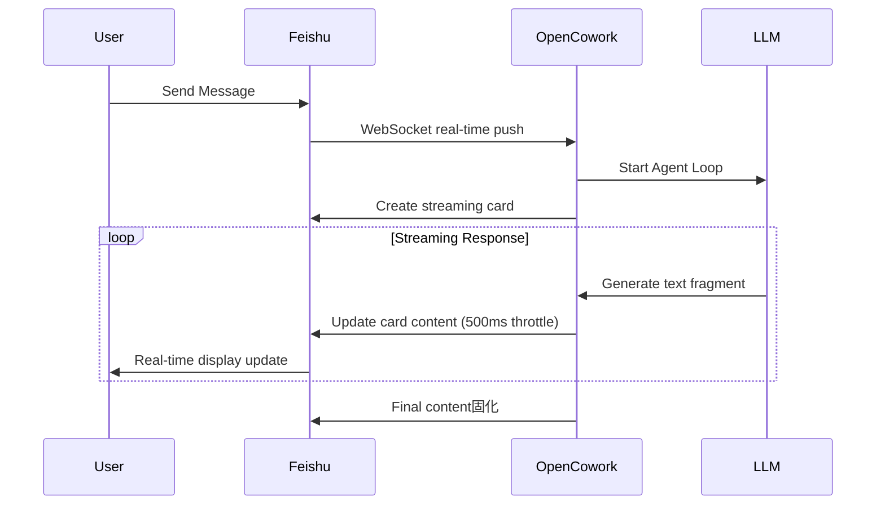
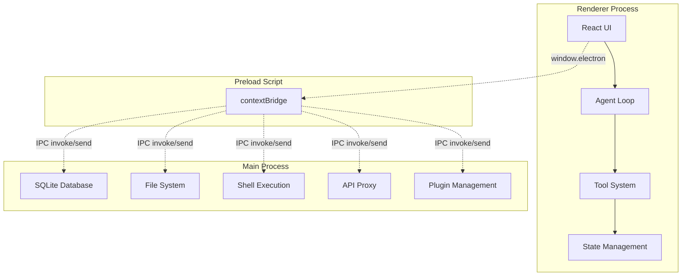

<p align="center">
  <a href="https://github.com/AIDotNet/OpenCowork">
    
  </a>
  <h1 align="center">OpenCowork</h1>
  <p align="center">
    <strong>Open-Source Desktop AI Agent Collaboration Platform</strong><br>
    Enable multiple AI agents to collaborate in local environments for true automation
  </p>
  <p align="center">
    🇨🇳 <a href="README.zh.md">中文</a> •
    <a href="#-core-features">Features</a> •
    <a href="#-architecture-overview">Architecture</a> •
    <a href="#-quick-start">Getting Started</a> •
    <a href="#-use-cases">Use Cases</a> •
    <a href="#-development-guide">Development</a>
  </p>
</p>

<p align="center">
  
  
  
  
  
</p>

---

## 🎯 Project Overview

**OpenCowork** is a **desktop AI agent collaboration platform** built with Electron + React + TypeScript. It's not just a chat interface, but a complete **multi-agent workspace** that supports:

- 🤖 **Multi-Agent Collaboration**: Lead Agent + Teammate Agent parallel work
- 🛠️ **Complete Toolchain**: File system, Shell commands, code search, task management
- 🔌 **Multi-Platform Integration**: Feishu, DingTalk, Telegram, Discord, WhatsApp, WeCom
- 🧠 **Professional Agents**: 15+ preset specialized agents (code review, architecture design, debugging, etc.)
- 📚 **Skill Ecosystem**: 16+ professional skill modules (PDF processing, web scraping, data analysis, etc.)

> **Core Philosophy**: Enable AI to go beyond conversation and truly **get things done** in local environments through multi-agent collaboration.

## 🚀 Core Features

### 🤖 Multi-Agent Collaboration System

**Agent Loop — Core Agentic Cycle**
```
User Message → [LLM Processing] → [Tool Calls] → [Execution Results] → [Iteration] → Final Output
```

- **Streaming Processing**: Event flow based on `AsyncGenerator` with real-time rendering and interruption control
- **Tool Ecosystem**: 15+ built-in tools + extensible plugin system
- **Context Management**: Intelligent compression and token threshold control for continuous long tasks
- **Approval Mechanism**: User approval flow for dangerous operations to ensure safety

**Multi-Agent Collaboration**
```
Lead Agent: Task Decomposition → Task Assignment → Progress Coordination → Result Integration
    ↓
Teammate Agents: Parallel Execution → Auto-claim Tasks → Status Sync → Result Reporting
```

- **Parallel Execution**: Up to 2 teammates working simultaneously for improved efficiency
- **Auto Task Claiming**: Automatically claim next available task after completion
- **Message Queue**: Inter-agent communication via `MessageQueue`
- **Event-Driven**: Real-time status synchronization and progress updates

### 🧠 Professional SubAgent Ecosystem

**15+ preset specialized agents**, each with dedicated system prompts and toolsets:

| Category | SubAgent | Expertise |
|----------|----------|-----------|
| 🏗️ **Architecture** | `api-designer`, `architect-reviewer` | API design, architecture review |
| 🔍 **Code Quality** | `code-reviewer`, `debugger`, `refactor-expert` | Code review, debugging, refactoring |
| 💻 **Development** | `frontend-developer`, `fullstack-developer`, `test-automator` | Frontend, fullstack, automated testing |
| 📊 **Data Analysis** | `data-analyst`, `performance-engineer` | Data analysis, performance optimization |
| 📝 **Content Creation** | `copywriter`, `doc-writer`, `translator` | Copywriting, documentation, translation |
| 🔒 **Security** | `security-auditor` | Security auditing |
| 📋 **Management** | `meeting-summarizer` | Meeting summarization |

**SubAgent Features**:
- **Restricted Toolset**: Each SubAgent can only access relevant tools
- **Independent Execution**: Inherit parent configuration, run tasks independently
- **Auto Approval**: Read-only tools auto-approved, write tools require parent approval
- **Concurrency Control**: Maximum 2 SubAgents running simultaneously globally

### 🔌 Multi-Platform Messaging Plugins

**Bring AI Agent capabilities directly to your workplace communication**

| Platform | Protocol Features | Status |
|----------|-------------------|--------|
| 🚀 **Feishu/Lark** | Lark SDK WebSocket + CardKit streaming cards | ✅ **Streaming Response** |
| 💼 **DingTalk** | WebSocket + Bot API | ✅ |
| 📱 **Telegram** | Bot API + Inline buttons | ✅ |
| 🎮 **Discord** | Gateway WebSocket + Slash Commands | ✅ |
| 💬 **WhatsApp** | WebSocket + Interactive messages | ✅ |
| 🏢 **WeCom** | WebSocket + Group chat integration | ✅ |

**Plugin Core Capabilities**:
- 🤖 **Auto Reply**: Automatically trigger Agent Loop on message receipt with full toolchain support
- 🔄 **Independent Sessions**: Each conversation has independent session with context continuity
- 🔒 **Permission Isolation**: Plugin-level security policies for file access and Shell permissions
- 🎯 **Model Binding**: Each plugin can bind dedicated AI Provider and model
- 📁 **File Transfer**: Support file upload/download, Agents can generate and send files directly

### 🌟 Feishu Bot Streaming Response - Technical Highlight

**True streaming conversational experience** based on Feishu CardKit API:



**Unique Advantages**:
- ⚡ **Real-time Typing Effect**: AI responses appear gradually like human typing
- 🖼️ **Multimodal Support**: Image message recognition, file upload/download
- 👥 **Group Chat Integration**: Only responds to `@bot` mentions in group chats, no disturbance
- 🔄 **Message Deduplication**: Automatic deduplication on WebSocket reconnection
- 📱 **Mobile Optimized**: Card-based interaction with excellent mobile experience

### 📚 Skill Ecosystem

**16+ professional skill modules** implemented through Markdown definitions + Python scripts:

| Skill Category | Skill Modules | Use Cases |
|----------------|--------------|-----------|
| 📄 **Document Processing** | `pdf-academic`, `pdf-legal`, `pdf-summary`, `pdf-data-extract` | Academic papers, legal clauses, document summarization, data extraction |
| 🌐 **Web Data** | `web-scraper`, `browser-session-crawler` | Dynamic page scraping, login state reuse crawler |
| 📊 **Data Processing** | `csv-pipeline`, `excel-processor` | Data cleaning, transformation, analysis |
| 📱 **Social Platforms** | `xiaohongshu-search`, `xiaohongshu-creator` | Xiaohongshu content search, note creation |
| 💬 **Office Automation** | `email-drafter`, `wechat-ui-sender` | Email drafting, WeChat message sending |
| 📝 **Content Creation** | `docx-creator`, `md-to-office` | Word document generation, Markdown conversion |
| 🎨 **Visualization** | `mermaid-diagram` | Flowcharts, architecture diagrams |
| 🔍 **OCR Recognition** | `image-ocr` | Image text recognition and extraction |

**Skill Features**:
- 📖 **Markdown Definition**: YAML frontmatter + instruction description
- 🐍 **Python Scripts**: Powerful data processing and automation capabilities
- 🎯 **AI Matching**: Agents automatically select appropriate skills based on descriptions
- 📁 **Working Directory**: Each skill has independent workspace
- 🔄 **Dynamic Loading**: Runtime loading from `~/.open-cowork/skills/`

### 🧩 Tool System

**Extensible tool architecture using registry pattern**:

```typescript
interface ToolHandler {
  definition: ToolDefinition    // JSON Schema definition
  execute: (input, ctx) => Promise<ToolResultContent>
  requiresApproval?: (input, ctx) => boolean
}
```

**Core Tool Set**:
| Tool Category | Tool Names | Function Description |
|---------------|------------|---------------------|
| 📁 **File Operations** | `Read`, `Write`, `Edit`, `LS` | File read/write, editing, directory browsing |
| 🔍 **Code Search** | `Glob`, `Grep` | File pattern matching, content search |
| 💻 **Shell Execution** | `Shell` | Command line execution with timeout and streaming output |
| 📋 **Task Management** | `TodoWrite`, `TodoRead` | Structured task tracking |
| 🛠️ **Skill Invocation** | `Skill` | Load and execute predefined skills |
| 👀 **File Preview** | `Preview` | Multi-format file preview |
| 🤖 **Agent Dispatch** | `Task` | Unified SubAgent/Teammate dispatch |
| 👥 **Team Management** | `TeamCreate`, `TaskCreate`, `TaskUpdate`, `TaskList`, `SendMessage`, `TeamStatus`, `TeamDelete` | Complete team collaboration tools |
| ⏰ **Scheduled Tasks** | `CronAdd`, `CronUpdate`, `CronDelete`, `CronList` | Persistent scheduled dispatch |
| 📢 **Notification System** | `Notify` | Desktop notifications and message injection |

### 🎯 AI Provider Support

**Unified multi-provider adaptation layer**:

| Provider | Model Support | Special Features |
|----------|--------------|------------------|
| 🧠 **Anthropic** | Claude 3.5/3.7 | Extended Thinking, Prompt Caching |
| 🚀 **OpenAI** | GPT-4/o1 | Reasoning Tokens, Function Calling |
| 🌐 **OpenAI Responses** | GPT-4/o1 | Responsive API |
| 🏢 **Azure OpenAI** | GPT series | Enterprise deployment |
| 🇨🇳 **Chinese Models** | DeepSeek, Qwen, Moonshot | Localized optimization |
| 🔄 **Compatible Platforms** | OpenRouter, SiliconFlow | Multi-model routing |
| 🦙 **Local Deployment** | Ollama | Private deployment |

**Technical Features**:
- 🔄 **SSE Streaming**: Unified streaming event handling
- 🎛️ **Unified Configuration**: Consistent API call interface
- 💾 **Auto Adaptation**: Automatic token limit and pricing adaptation
- 🧠 **Deep Thinking**: Support for Thinking/Reasoning modes

### ⏰ Scheduled Tasks & Dispatch

**Persistent dispatch system based on node-cron**:

```typescript
// Support multiple scheduling methods
{
  "type": "cron",        // Cron expression: "0 9 * * 1-5"
  "type": "interval",    // Fixed interval: "every 30 minutes"  
  "type": "at",          // Scheduled execution: "at 2026-12-31 23:59"
}
```

**Core Features**:
- 💾 **Persistent Storage**: SQLite storage, survives restarts
- 🤖 **CronAgent**: Dedicated scheduled task execution agent
- 🔌 **Plugin Routing**: Support sending results to messaging platforms
- 📊 **Management Interface**: Complete task management UI
- 🔄 **Auto Recovery**: Automatically load scheduled tasks after app restart

### 🔧 MCP Protocol Support

**Model Context Protocol (MCP) Integration**:
- 🔌 **External Extensions**: Connect MCP Servers to extend agent capabilities
- 🛠️ **Standardized Interface**: Unified tool and resource access protocol
- 🌐 **Ecosystem Compatibility**: Support various tools in MCP ecosystem

### 🎨 Interface & User Experience

**Modern desktop application experience**:

```
┌──────────────────────────────────────────────────────┐
│  🖥️ Custom title bar + window controls + system tray   │
├──────────┬───────────────────────┬───────────────────┤
│ 📱 Session List │    💬 Chat Area        │   🔧 Right Panel   │
│ (AppSidebar)   │  (MessageList +       │  (Steps/Team/     │
│                │   InputArea)         │   Artifacts/     │
│                │                      │   Context/       │
│                │                      │   Skills/Files)  │
├──────────┴───────────────────────┴───────────────────┤
│ 📋 Detail Panel / Preview Panel (optional, overlay)    │
└──────────────────────────────────────────────────────┘
```

**Interface Features**:
- 🌓 **Theme System**: Dark/light themes, auto-follow system
- 🌍 **Internationalization**: Bilingual support (Chinese/English)
- 💻 **Monaco Editor**: Professional code editor integration
- 📄 **File Preview**: Full format support for PDF, Excel, Word, images, Markdown
- ⚡ **Command Palette**: cmdk quick operations
- 🎭 **Animations**: Smooth animations with Motion (Framer Motion)
- 📱 **Responsive Design**: Adapts to different screen sizes

## 🏗️ Architecture Overview

### Three-Process Electron Architecture



**Process Responsibilities**:
- **🎨 Renderer Process**: React UI + Agent Logic + Tool Execution
- **🔗 Preload**: Secure bridge, exposes `window.electron` API
- **⚙️ Main Process**: Lightweight, handles system-level operations and data persistence

### Core Technology Stack

| Layer | Technology | Version | Purpose |
|-------|------------|---------|---------|
| 🖥️ **Runtime** | Electron | 36.x | Desktop application framework |
| 🛠️ **Build** | electron-vite + Vite | 5.x / 7.x | Fast development and building |
| ⚛️ **Frontend** | React + TypeScript | 19.x / 5.9 | User interface and logic |
| 🎨 **Styling** | Tailwind CSS + shadcn/ui | 4.1 / new-york | Modern UI components |
| 🗄️ **State** | Zustand + Immer | 5.x / 11.x | State management and persistence |
| 💾 **Data** | better-sqlite3 | 12.x | Local database (WAL mode) |
| 💻 **Editor** | Monaco Editor | 0.55 | Code editing and preview |
| 🎭 **Animations** | Motion (Framer Motion) | 12.x | Smooth animation effects |
| 📦 **Packaging** | electron-builder | 26.x | Cross-platform packaging |

## 🚀 Quick Start

### Prerequisites

- **Node.js** >= 18.x
- **npm** >= 9.x or **yarn** >= 1.22
- **Git** for cloning repository

### Installation and Running

```bash
# 🔄 Clone repository
git clone https://github.com/AIDotNet/OpenCowork.git
cd OpenCowork

# 📦 Install dependencies
npm install

# 🚀 Start development environment (hot reload)
npm run dev

# 🔍 Type checking
npm run typecheck

# 🏗️ Build production version
npm run build:win    # Windows
npm run build:mac    # macOS  
npm run build:linux  # Linux
```

### First-Time Configuration

1. **🔑 Configure AI Provider**
   - Open Settings → AI Provider
   - Add API Key (supports Anthropic, OpenAI, etc.)
   - Select default model

2. **🤖 Explore SubAgents**
   - Type `@code-reviewer` in chat to try code review
   - Try `@planner` to create project plans
   - Use `@data-analyst` to analyze data

3. **🔌 Connect Messaging Platforms** (optional)
   - Settings → Plugins → Enable Feishu/DingTalk etc.
   - Configure bot tokens and secrets
   - Enjoy streaming AI conversation experience

## 📁 Project Structure

```
OpenCowork/
├── 📂 src/
│   ├── 🖥️ main/                      # Electron Main Process
│   │   ├── 📋 index.ts               # App entry: window creation, IPC registration
│   │   ├── 💾 db/                    # SQLite Data Layer
│   │   │   ├── database.ts           # Database initialization (WAL, schema, migrations)
│   │   │   ├── sessions-dao.ts       # Session DAO
│   │   │   └── messages-dao.ts       # Message DAO
│   │   ├── 🔄 ipc/                   # IPC Handler Modules (separation of concerns)
│   │   │   ├── api-proxy.ts          # AI API HTTP/SSE streaming proxy
│   │   │   ├── fs-handlers.ts        # File system operations (read/write/glob/grep/watch)
│   │   │   ├── shell-handlers.ts     # Shell command execution (timeout/output stream)
│   │   │   ├── process-manager.ts    # Long-running process management (dev server)
│   │   │   ├── db-handlers.ts        # Database IPC bridging
│   │   │   ├── agents-handlers.ts    # Agent definition loading
│   │   │   ├── skills-handlers.ts    # Skill definition loading
│   │   │   ├── settings-handlers.ts  # settings.json read/write
│   │   │   └── secure-key-store.ts   # config.json read/write (API Keys etc.)
│   │   ├── 🔌 plugins/               # Messaging platform plugins
│   │   │   └── providers/           # Feishu/DingTalk/Telegram/Discord/WhatsApp/WeCom
│   │   ├── ⏰ cron/                  # Scheduled task dispatch
│   │   └── 🔗 mcp/                   # MCP Server management
│   ├── 🔗 preload/                   # Preload Scripts
│   │   ├── 📋 index.ts               # contextBridge exposes electron API
│   │   └── 📝 index.d.ts             # Window type declarations
│   └── 🎨 renderer/                  # Renderer Process (React SPA)
│       └── src/
│           ├── 📱 App.tsx            # App root component (providers/tools/viewers init)
│           ├── 🚀 main.tsx           # React DOM entry
│           ├── 🧩 components/        # UI Components
│           │   ├── 💬 chat/          # Chat message components (13)
│           │   ├── 👥 cowork/        # Collaboration panel components (8)
│           │   ├── 🖼️ layout/        # Layout components (8)
│           │   ├── ⚙️ settings/      # Settings components (5)
│           │   ├── 🎨 ui/            # shadcn/ui base components (28)
│           │   └── 🎭 animate-ui/    # Animation components
│           ├── 🪝 hooks/             # React Hooks
│           │   ├── 💬 use-chat-actions.ts  # Core: hook driving Agent Loop
│           │   ├── 🖥️ use-dev-server.ts    # Dev server preview
│           │   ├── 👀 use-file-watcher.ts  # File change monitoring
│           │   └── ...
│           ├── 🗄️ stores/            # Zustand State Management
│           │   ├── 💬 chat-store.ts      # Sessions/messages + DB persistence
│           │   ├── 🤖 agent-store.ts     # Agent runtime state/tool calls/approval flow
│           │   ├── 👥 team-store.ts      # Team state (members/tasks/messages)
│           │   ├── 🎯 provider-store.ts  # AI provider/model management
│           │   ├── ⚙️ settings-store.ts  # User settings
│           │   ├── 🎨 ui-store.ts        # UI state (panels/modes/preview)
│           │   ├── 📋 task-store.ts      # Todo tasks
│           │   ├── 🛠️ skills-store.ts    # Skills list
│           │   └── 🌐 providers/         # 15+ built-in provider presets
│           └── 📚 lib/               # Core Logic Library
│               ├── 🤖 agent/         # ★ Agent System Core
│               │   ├── 🔄 agent-loop.ts          # Agentic Loop (AsyncGenerator)
│               │   ├── 🛠️ tool-registry.ts       # Tool registry
│               │   ├── 📝 system-prompt.ts       # System prompt construction
│               │   ├── 📋 types.ts               # Agent type definitions
│               │   ├── 🚦 concurrency-limiter.ts # Semaphore concurrency control
│               │   ├── 👥 sub-agents/            # SubAgent subsystem
│               │   └── 🏗️ teams/                 # Agent Teams subsystem
│               ├── 🛠️ tools/         # Tool Implementations
│               │   ├── 📋 index.ts           # Unified tool registration entry
│               │   ├── 📝 tool-types.ts      # ToolHandler / ToolContext types
│               │   ├── 📁 fs-tool.ts         # File operations (Read/Write/Edit/LS)
│               │   ├── 🔍 search-tool.ts     # Search (Glob/Grep)
│               │   ├── 💻 bash-tool.ts       # Shell execution
│               │   ├── 📋 todo-tool.ts       # Task management (TodoWrite/TodoRead)
│               │   ├── 🛠️ skill-tool.ts      # Skill loading tool
│               │   └── 👀 preview-tool.ts    # File preview tool
│               ├── 🌐 api/           # AI API Adaptation Layer
│               │   ├── 📋 types.ts           # Unified type system
│               │   ├── 🏭 provider.ts        # Provider factory
│               │   ├── 📝 index.ts           # Provider registration entry
│               │   ├── 🧠 anthropic.ts       # Anthropic API adaptation
│               │   ├── 🚀 openai-chat.ts     # OpenAI Chat API adaptation
│               │   ├── 🌐 openai-responses.ts # OpenAI Responses API adaptation
│               │   ├── 📡 sse-parser.ts      # SSE event parsing
│               │   └── 📄 generate-title.ts  # Session title auto-generation
│               ├── 🔄 ipc/           # IPC Communication Layer
│               │   ├── 🌐 ipc-client.ts      # IPC client wrapper
│               │   ├── 📡 api-stream.ts      # SSE streaming request (IPC → AsyncIterable)
│               │   ├── 📋 channels.ts        # IPC channel constants
│               │   ├── 💾 ipc-storage.ts     # Zustand persistence → settings.json
│               │   └── 🔐 config-storage.ts  # Zustand persistence → config.json
│               ├── 👀 preview/       # File Preview System
│               │   ├── 📋 viewer-registry.ts     # Viewer registry
│               │   ├── 📝 register-viewers.ts    # Built-in viewer registration
│               │   └── 👀 viewers/               # HTML/Spreadsheet/DevServer/Markdown
│               └── 🔧 utils/         # Common utility functions
├── 📦 resources/                     # Built-in resources (packaged with app)
│   ├── 🤖 agents/                    # Built-in SubAgent definitions (.md)
│   └── 🛠️ skills/                    # Built-in Skill definitions (directory/SKILL.md)
├── 🏗️ build/                         # Build resources (icons/signatures)
└── 📄 Configuration files           # package.json, tsconfig, electron.vite.config.ts etc.
```

### User Data Directory

```
~/.open-cowork/
├── 💾 data.db          # SQLite database (sessions + messages)
├── ⚙️ settings.json    # Zustand persistent state (settings/Agent/Team)
├── 🔐 config.json      # Provider API keys and other sensitive configuration
├── 🤖 agents/          # SubAgent definition files (*.md)
└── 🛠️ skills/          # Skill definition directories ({name}/SKILL.md)
```

## 💡 Use Cases

### 🏢 Enterprise Collaboration Scenarios

**Automated Code Review**
```
User: "@code-reviewer Please review src/components/UserForm.tsx"
Agent: Automatically analyze code quality, security vulnerabilities, performance issues
Output: Detailed review report + improvement suggestions + fix code examples
```

**Project Planning Management**
```
User: "@planner Help me plan e-commerce backend development"
Agent: Task decomposition → Duration estimation → Team assignment → Progress tracking
Output: Complete project plan + milestones + risk assessment
```

**Data Analysis Reports**
```
User: "@data-analyst Analyze sales.csv and generate report"
Agent: Data cleaning → Statistical analysis → Visualization → Report generation
Output: PDF report + Excel charts + Markdown summary
```

### 🤖 Automated Workflows

**Scheduled Task Dispatch**
```typescript
// Automatically generate daily work report at 9 AM every day
{
  "name": "Daily Work Report",
  "schedule": "0 9 * * 1-5",
  "skill": "daily-report",
  "plugin": "feishu",
  "chat_id": "daily_report_group"
}
```

**Messaging Platform Integration**
- 📱 **Feishu Group Chat**: @bot to get code analysis results
- 💼 **DingTalk Workspace**: Automatic task reminders and progress updates
- 🎮 **Discord Channels**: Development assistance and code review
- 📱 **WhatsApp**: Customer service automation

### 🛠️ Developer Tools

**Local Development Assistant**
- 🔍 **Code Search**: Quickly locate code patterns and structures
- 🐛 **Debugging Assistance**: Analyze error logs, provide fix suggestions
- 📝 **Documentation Generation**: Automatically generate API docs and code comments
- 🚀 **Performance Optimization**: Analyze performance bottlenecks, optimization suggestions

## 🧩 Development Guide

### Adding New Tools

1. **Create Tool Implementation**
```typescript
// src/renderer/src/lib/tools/my-tool.ts
export const myTool: ToolHandler = {
  definition: {
    name: 'MyTool',
    description: 'Custom tool description',
    inputSchema: { /* JSON Schema */ }
  },
  execute: async (input, ctx) => {
    // Tool logic implementation
    return { type: 'text', text: 'Execution result' }
  }
}
```

2. **Register Tool**
```typescript
// src/renderer/src/lib/tools/index.ts
export function registerAllTools() {
  toolRegistry.register(myTool)
}
```

### Creating SubAgents

1. **Define SubAgent**
```markdown
---
name: MyExpert
description: Professional domain expert
icon: brain
allowedTools: Read, Write, Grep, MyTool
maxIterations: 10
---

You are a [domain] expert specializing in [specific tasks]...
```

2. **Place in User Directory**
```bash
cp my-agent.md ~/.open-cowork/agents/
```

### Developing Skill Modules

1. **Create Skill Directory**
```bash
mkdir ~/.open-cowork/skills/my-skill
```

2. **Define Skill**
```markdown
# ~/.open-cowork/skills/my-skill/SKILL.md
---
description: Professional skill description
workingDirectory: /path/to/workspace
---

## Skill Description
Detailed description of skill functionality and usage...

## Usage
1. Step one
2. Step two
```

3. **Add Script**
```python
# ~/.open-cowork/skills/my-skill/main.py
def main():
    # Python script implementation
    pass
```

### Building and Publishing

```bash
# 🔍 Run tests
npm run test

# 📝 Code checking
npm run lint
npm run typecheck

# 🏗️ Build application
npm run build

# 📦 Package for release
npm run build:win    # Windows
npm run build:mac    # macOS
npm run build:linux  # Linux
```

## 🤝 Contributing Guide

We welcome all forms of contributions!

### 🐛 Reporting Issues
- Use [GitHub Issues](https://github.com/AIDotNet/OpenCowork/issues) to report bugs
- Provide detailed reproduction steps and environment information
- Include relevant logs and screenshots

### 💡 Feature Suggestions
- Propose new feature suggestions in Issues
- Describe use cases and expected effects in detail
- Discuss technical implementation approaches

### 🔧 Code Contributions
1. Fork the project repository
2. Create a feature branch (`git checkout -b feature/amazing-feature`)
3. Commit your changes (`git commit -m 'Add amazing feature'`)
4. Push to the branch (`git push origin feature/amazing-feature`)
5. Create a Pull Request

### 📝 Documentation Improvements
- Improve accuracy and completeness of existing documentation
- Add usage examples and best practices
- Translate documentation to other languages

## 📞 Community & Support

| Channel | Purpose | Link |
|---------|---------|------|
| 💬 **GitHub Issues** | Bug reports, feature requests | [Issues](https://github.com/AIDotNet/OpenCowork/issues) |
| 📖 **GitHub Discussions** | Q&A, discussions | [Discussions](https://github.com/AIDotNet/OpenCowork/discussions) |
| 📧 **Email Support** | Business cooperation, technical support | support@opencowork.ai |
| 🐦 **Social Media** | Project updates, notifications | [@OpenCoworkAI](https://twitter.com/OpenCoworkAI) |

## 🗺️ Roadmap

### v0.3.0 (Planned)
- 🔄 **Workflow Engine**: Visual workflow design and execution
- 🌐 **Web Interface**: Browser access support
- 📊 **Data Visualization**: Built-in charts and dashboards
- 🔌 **Plugin Marketplace**: Community plugin store

### v0.4.0 (In Planning)
- 🤖 **AI Training**: Custom model fine-tuning
- 🏢 **Enterprise Edition**: SSO, permission management, audit logs
- 🌍 **Multi-Cloud Deployment**: AWS, Azure, Alibaba Cloud support
- 📱 **Mobile Apps**: iOS/Android applications

## 📄 License

This project is licensed under the [MIT License](LICENSE).

---

<div align="center">

**⭐ If this project helps you, please give us a Star!**

Made with ❤️ by the OpenCowork Team

</div>
