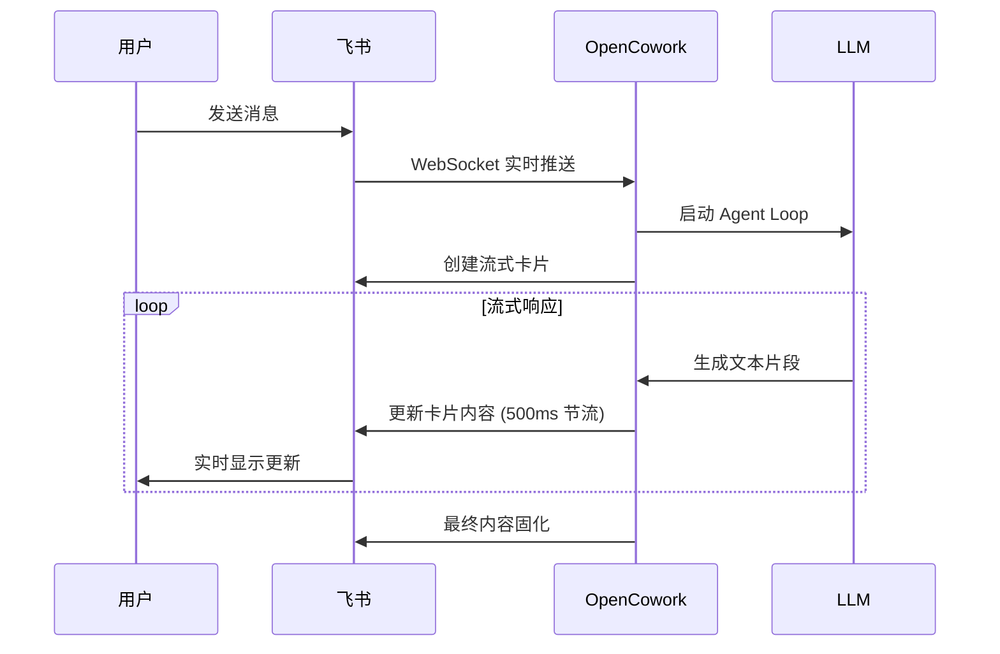
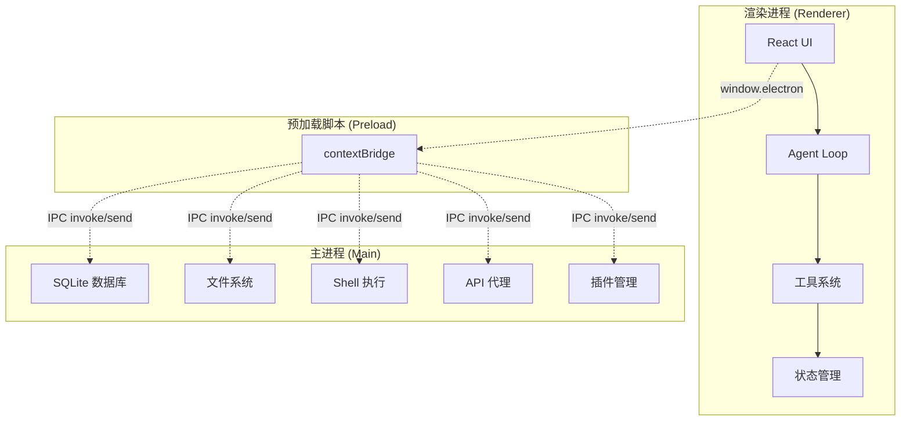

<p align="center">
  <a href="https://github.com/AIDotNet/OpenCowork">
    
  </a>
  <h1 align="center">OpenCowork</h1>
  <p align="center">
    <strong>开源桌面 AI Agent 协作平台</strong><br>
    让多智能体在本地环境中协同工作，真正实现 AI 自动化
  </p>
  <p align="center">
    🇺🇸 <a href="README.md">English</a> •
    <a href="#-核心特性">特性</a> •
    <a href="#-架构概览">架构</a> •
    <a href="#-快速开始">开始</a> •
    <a href="#-使用场景">场景</a> •
    <a href="#-开发指南">开发</a>
  </p>
</p>

<p align="center">
  
  
  
  
  
</p>

---

## 🎯 项目概述

**OpenCowork** 是一个基于 Electron + React + TypeScript 构建的**桌面 AI Agent 协作平台**。它不仅是一个聊天界面，更是一个完整的**多智能体工作台**，支持：

- 🤖 **多 Agent 协作**：Lead Agent + Teammate Agent 并行工作
- 🛠️ **完整工具链**：文件系统、Shell 命令、代码搜索、任务管理
- 🔌 **多平台集成**：飞书、钉钉、Telegram、Discord、WhatsApp、企业微信
- 🧠 **专业智能体**：15+ 预设专业 Agent (代码审查、架构设计、调试等)
- 📚 **技能生态**：16+ 专业技能模块 (PDF处理、Web爬虫、数据分析等)

> **核心理念**：让 AI 不只是对话，而是真正在本地环境中**动手干活**，通过多智能体协作完成复杂任务。

## 🚀 核心特性

### 🤖 多智能体协作系统

**Agent Loop — 核心 Agentic 循环**
```
用户消息 → [LLM 处理] → [工具调用] → [执行结果] → [迭代优化] → 最终输出
```

- **流式处理**：基于 `AsyncGenerator` 的事件流，支持实时渲染和中断控制
- **工具生态**：15+ 内置工具 + 可扩展插件系统
- **上下文管理**：智能压缩和 token 阈值控制，支持长任务不断档
- **审批机制**：危险操作的用户审批流，确保安全性

**多 Agent 协作**
```
Lead Agent: 任务分解 → 派发任务 → 协调进度 → 整合结果
    ↓
Teammate Agents: 并行执行 → 自动认领 → 状态同步 → 结果汇报
```

- **并行执行**：最多 2 个 Teammate 同时工作，提升效率
- **任务自动认领**：完成后自动获取下一个可用任务
- **消息队列**：Agent 间通过 `MessageQueue` 通信
- **事件驱动**：实时状态同步和进度更新

### 🧠 专业 SubAgent 生态

**15+ 预设专业智能体**，每个都有专门的系统提示词和工具集：

| 类别 | SubAgent | 专长领域 |
|------|----------|----------|
| 🏗️ **架构设计** | `api-designer`, `architect-reviewer` | API 设计、架构审查 |
| 🔍 **代码质量** | `code-reviewer`, `debugger`, `refactor-expert` | 代码审查、调试、重构 |
| 💻 **开发实践** | `frontend-developer`, `fullstack-developer`, `test-automator` | 前端、全栈、自动化测试 |
| 📊 **数据分析** | `data-analyst`, `performance-engineer` | 数据分析、性能优化 |
| 📝 **内容创作** | `copywriter`, `doc-writer`, `translator` | 文案、文档、翻译 |
| 🔒 **安全合规** | `security-auditor` | 安全审计 |
| 📋 **项目管理** | `meeting-summarizer` | 会议总结 |

**SubAgent 特性**：
- **受限工具集**：每个 SubAgent 只能访问相关工具
- **独立运行**：继承父级配置，独立执行任务
- **自动审批**：只读工具自动通过，写入工具需父级审批
- **并发控制**：全局最多 2 个 SubAgent 同时运行

### 🔌 多平台消息插件

**将 AI Agent 能力直接投射到你的工作沟通场景**

| 平台 | 协议特性 | 状态 |
|------|----------|------|
| 🚀 **飞书 (Feishu/Lark)** | Lark SDK WebSocket + CardKit 流式卡片 | ✅ **流式响应** |
| 💼 **钉钉 (DingTalk)** | WebSocket + 机器人 API | ✅ |
| 📱 **Telegram** | Bot API + 内联按钮 | ✅ |
| 🎮 **Discord** | Gateway WebSocket + Slash Commands | ✅ |
| 💬 **WhatsApp** | WebSocket + 交互式消息 | ✅ |
| 🏢 **企业微信 (WeCom)** | WebSocket + 群聊集成 | ✅ |

**插件核心能力**：
- 🤖 **自动回复**：收到消息自动触发 Agent Loop，完整工具链支持
- 🔄 **独立会话**：每个对话独立 session，上下文连续性
- 🔒 **权限隔离**：插件级安全策略，文件访问和 Shell 权限控制
- 🎯 **模型绑定**：每个插件可绑定专属 AI Provider 和模型
- 📁 **文件传输**：支持文件上传/下载，Agent 可生成文件直接发送

### 🌟 飞书 Bot 流式响应 - 技术亮点

**真正的流式对话体验**，基于飞书 CardKit API：



**独特优势**：
- ⚡ **实时打字效果**：AI 回答像真人打字一样逐步出现
- 🖼️ **多模态支持**：图片消息识别、文件上传/下载
- 👥 **群聊集成**：群聊中仅 `@机器人` 时响应，不打扰讨论
- 🔄 **消息去重**：WebSocket 重连自动去重，防止重复处理
- 📱 **移动端优化**：卡片式交互，移动端体验优秀

### 📚 技能生态系统

**16+ 专业技能模块**，通过 Markdown 定义 + Python 脚本实现：

| 技能类别 | 技能模块 | 应用场景 |
|----------|----------|----------|
| 📄 **文档处理** | `pdf-academic`, `pdf-legal`, `pdf-summary`, `pdf-data-extract` | 学术论文、法律条款、文档摘要、数据提取 |
| 🌐 **Web 数据** | `web-scraper`, `browser-session-crawler` | 动态页面抓取、登录态复用爬虫 |
| 📊 **数据处理** | `csv-pipeline`, `excel-processor` | 数据清洗、转换、分析 |
| 📱 **社交平台** | `xiaohongshu-search`, `xiaohongshu-creator` | 小红书内容搜索、笔记创作 |
| 💬 **办公自动化** | `email-drafter`, `wechat-ui-sender` | 邮件草稿、微信消息发送 |
| 📝 **内容创作** | `docx-creator`, `md-to-office` | Word 文档生成、Markdown 转换 |
| 🎨 **可视化** | `mermaid-diagram` | 流程图、架构图生成 |
| 🔍 **OCR 识别** | `image-ocr` | 图片文字识别提取 |

**技能特性**：
- 📖 **Markdown 定义**：YAML frontmatter + 指令描述
- 🐍 **Python 脚本**：强大的数据处理和自动化能力
- 🎯 **AI 匹配**：Agent 根据描述自动选择合适技能
- 📁 **工作目录**：每个技能有独立的工作空间
- 🔄 **动态加载**：运行时从 `~/.open-cowork/skills/` 加载

### 🧩 工具系统

**注册表模式**的可扩展工具架构：

```typescript
interface ToolHandler {
  definition: ToolDefinition    // JSON Schema 定义
  execute: (input, ctx) => Promise<ToolResultContent>
  requiresApproval?: (input, ctx) => boolean
}
```

**核心工具集**：
| 工具类别 | 工具名称 | 功能描述 |
|----------|----------|----------|
| 📁 **文件操作** | `Read`, `Write`, `Edit`, `LS` | 文件读写、编辑、目录浏览 |
| 🔍 **代码搜索** | `Glob`, `Grep` | 文件模式匹配、内容搜索 |
| 💻 **Shell 执行** | `Shell` | 命令行执行，支持超时和流式输出 |
| 📋 **任务管理** | `TodoWrite`, `TodoRead` | 结构化任务追踪 |
| 🛠️ **技能调用** | `Skill` | 加载和执行预定义技能 |
| 👀 **文件预览** | `Preview` | 多格式文件预览 |
| 🤖 **Agent 调度** | `Task` | 统一 SubAgent/Teammate 调度 |
| 👥 **团队管理** | `TeamCreate`, `TaskCreate`, `TaskUpdate`, `TaskList`, `SendMessage`, `TeamStatus`, `TeamDelete` | 完整的团队协作工具 |
| ⏰ **定时任务** | `CronAdd`, `CronUpdate`, `CronDelete`, `CronList` | 持久化定时调度 |
| 📢 **通知系统** | `Notify` | 桌面通知和消息注入 |

### 🎯 AI Provider 支持

**统一的多供应商适配层**：

| 供应商 | 模型支持 | 特色功能 |
|--------|----------|----------|
| 🧠 **Anthropic** | Claude 3.5/3.7 | Extended Thinking, Prompt Caching |
| 🚀 **OpenAI** | GPT-4/o1 | Reasoning Tokens, Function Calling |
| 🌐 **OpenAI Responses** | GPT-4/o1 | 响应式 API |
| 🏢 **Azure OpenAI** | GPT 系列 | 企业级部署 |
| 🇨🇳 **国内模型** | DeepSeek, Qwen, Moonshot | 本土化优化 |
| 🔄 **兼容平台** | OpenRouter, SiliconFlow | 多模型路由 |
| 🦙 **本地部署** | Ollama | 私有化部署 |

**技术特性**：
- 🔄 **SSE 流式传输**：统一的流式事件处理
- 🎛️ **统一配置**：一致的 API 调用接口
- 💾 **自动适配**：token 上限和定价自动适配
- 🧠 **深度思考**：支持 Thinking/Reasoning 模式

### ⏰ 定时任务与调度

**基于 node-cron 的持久化调度系统**：

```typescript
// 支持多种调度方式
{
  "type": "cron",        // Cron 表达式: "0 9 * * 1-5"
  "type": "interval",    // 固定间隔: "every 30 minutes"  
  "type": "at",          // 定时执行: "at 2026-12-31 23:59"
}
```

**核心特性**：
- 💾 **持久化存储**：SQLite 存储，重启不丢失
- 🤖 **CronAgent**：专门的定时任务执行 Agent
- 🔌 **插件路由**：支持将结果发送到消息平台
- 📊 **管理界面**：完整的任务管理 UI
- 🔄 **自动恢复**：应用重启后自动加载定时任务

### 🔧 MCP 协议支持

**Model Context Protocol (MCP) 集成**：
- 🔌 **外部扩展**：连接 MCP Server 扩展 Agent 能力
- 🛠️ **标准化接口**：统一的工具和资源访问协议
- 🌐 **生态兼容**：支持 MCP 生态中的各种工具

### 🎨 界面与用户体验

**现代化桌面应用体验**：

```
┌──────────────────────────────────────────────────────┐
│  🖥️ 自定义标题栏 + 窗口控制 + 系统托盘集成              │
├──────────┬───────────────────────┬───────────────────┤
│ 📱 会话列表 │    💬 聊天区域          │   🔧 右侧面板      │
│ (AppSidebar)│  (MessageList +       │  (Steps/Team/     │
│             │   InputArea)         │   Artifacts/     │
│             │                      │   Context/       │
│             │                      │   Skills/Files)  │
├──────────┴───────────────────────┴───────────────────┤
│ 📋 详情面板 / 预览面板 (可选，覆盖式显示)                │
└──────────────────────────────────────────────────────┘
```

**界面特性**：
- 🌓 **主题系统**：深色/浅色主题，自动跟随系统
- 🌍 **国际化**：中英双语支持
- 💻 **Monaco Editor**：专业代码编辑器集成
- 📄 **文件预览**：PDF、Excel、Word、图片、Markdown 全格式支持
- ⚡ **命令面板**：cmdk 快速操作
- 🎭 **动画效果**：Motion (Framer Motion) 流畅动画
- 📱 **响应式设计**：适配不同屏幕尺寸

## 🏗️ 架构概览

### 三进程 Electron 架构



**进程职责**：
- **🎨 渲染进程**：React UI + Agent 逻辑 + 工具执行
- **🔗 Preload**：安全桥接，暴露 `window.electron` API
- **⚙️ 主进程**：轻量级，负责系统级操作和数据持久化

### 核心技术栈

| 层级 | 技术 | 版本 | 作用 |
|------|------|------|------|
| 🖥️ **运行时** | Electron | 36.x | 桌面应用框架 |
| 🛠️ **构建** | electron-vite + Vite | 5.x / 7.x | 快速开发和构建 |
| ⚛️ **前端** | React + TypeScript | 19.x / 5.9 | 用户界面和逻辑 |
| 🎨 **样式** | Tailwind CSS + shadcn/ui | 4.1 / new-york | 现代化 UI 组件 |
| 🗄️ **状态** | Zustand + Immer | 5.x / 11.x | 状态管理和持久化 |
| 💾 **数据** | better-sqlite3 | 12.x | 本地数据库 (WAL 模式) |
| 💻 **编辑器** | Monaco Editor | 0.55 | 代码编辑和预览 |
| 🎭 **动画** | Motion (Framer Motion) | 12.x | 流畅动画效果 |
| 📦 **打包** | electron-builder | 26.x | 跨平台打包 |

## 🚀 快速开始

### 环境要求

- **Node.js** >= 18.x
- **npm** >= 9.x 或 **yarn** >= 1.22
- **Git** 用于克隆仓库

### 安装和运行

```bash
# 🔄 克隆仓库
git clone https://github.com/AIDotNet/OpenCowork.git
cd OpenCowork

# 📦 安装依赖
npm install

# 🚀 启动开发环境（热重载）
npm run dev

# 🔍 类型检查
npm run typecheck

# 🏗️ 构建生产版本
npm run build:win    # Windows
npm run build:mac    # macOS  
npm run build:linux  # Linux
```

### 首次配置

1. **🔑 配置 AI Provider**
   - 打开设置 → AI Provider
   - 添加 API Key (支持 Anthropic、OpenAI 等)
   - 选择默认模型

2. **🤖 探索 SubAgent**
   - 在聊天中输入 `@code-reviewer` 试用代码审查
   - 试试 `@planner` 制定项目计划
   - 使用 `@data-analyst` 分析数据

3. **🔌 连接消息平台** (可选)
   - 设置 → 插件 → 启用飞书/钉钉等
   - 配置机器人 Token 和密钥
   - 享受流式 AI 对话体验

## 📁 项目结构

```
OpenCowork/
├── 📂 src/
│   ├── 🖥️ main/                      # Electron 主进程
│   │   ├── 📋 index.ts               # 应用入口：窗口创建、IPC 注册
│   │   ├── 💾 db/                    # SQLite 数据层
│   │   │   ├── database.ts           # 数据库初始化 (WAL, 建表, 迁移)
│   │   │   ├── sessions-dao.ts       # 会话 DAO
│   │   │   └── messages-dao.ts       # 消息 DAO
│   │   ├── 🔄 ipc/                   # IPC Handler 模块 (职责分离)
│   │   │   ├── api-proxy.ts          # AI API HTTP/SSE 流式代理
│   │   │   ├── fs-handlers.ts        # 文件系统操作 (读写/glob/grep/watch)
│   │   │   ├── shell-handlers.ts     # Shell 命令执行 (超时/输出流)
│   │   │   ├── process-manager.ts    # 长驻进程管理 (dev server)
│   │   │   ├── db-handlers.ts        # 数据库 IPC 桥接
│   │   │   ├── agents-handlers.ts    # Agent 定义加载
│   │   │   ├── skills-handlers.ts    # Skill 定义加载
│   │   │   ├── settings-handlers.ts  # settings.json 读写
│   │   │   └── secure-key-store.ts   # config.json 读写 (API Key 等)
│   │   ├── 🔌 plugins/               # 消息平台插件
│   │   │   └── providers/           # 飞书/钉钉/Telegram/Discord/WhatsApp/企业微信
│   │   ├── ⏰ cron/                  # 定时任务调度
│   │   └── 🔗 mcp/                   # MCP Server 管理
│   ├── 🔗 preload/                   # Preload 脚本
│   │   ├── 📋 index.ts               # contextBridge 暴露 electron API
│   │   └── 📝 index.d.ts             # Window 类型声明
│   └── 🎨 renderer/                  # 渲染进程 (React SPA)
│       └── src/
│           ├── 📱 App.tsx            # 应用根组件 (providers/tools/viewers 初始化)
│           ├── 🚀 main.tsx           # React DOM 入口
│           ├── 🧩 components/        # UI 组件
│           │   ├── 💬 chat/          # 聊天消息组件 (13 个)
│           │   ├── 👥 cowork/        # 协作面板组件 (8 个)
│           │   ├── 🖼️ layout/        # 布局组件 (8 个)
│           │   ├── ⚙️ settings/      # 设置组件 (5 个)
│           │   ├── 🎨 ui/            # shadcn/ui 基础组件 (28 个)
│           │   └── 🎭 animate-ui/    # 动画组件
│           ├── 🪝 hooks/             # React Hooks
│           │   ├── 💬 use-chat-actions.ts  # 核心：驱动 Agent Loop 的 hook
│           │   ├── 🖥️ use-dev-server.ts    # Dev server 预览
│           │   ├── 👀 use-file-watcher.ts  # 文件变更监听
│           │   └── ...
│           ├── 🗄️ stores/            # Zustand 状态管理
│           │   ├── 💬 chat-store.ts      # 会话/消息 + DB 持久化
│           │   ├── 🤖 agent-store.ts     # Agent 运行状态/工具调用/审批流
│           │   ├── 👥 team-store.ts      # 团队状态 (成员/任务/消息)
│           │   ├── 🎯 provider-store.ts  # AI 供应商/模型管理
│           │   ├── ⚙️ settings-store.ts  # 用户设置
│           │   ├── 🎨 ui-store.ts        # UI 状态 (面板/模式/预览)
│           │   ├── 📋 task-store.ts      # Todo 任务
│           │   ├── 🛠️ skills-store.ts    # Skills 列表
│           │   └── 🌐 providers/         # 15+ 内置供应商预设
│           └── 📚 lib/               # 核心逻辑库
│               ├── 🤖 agent/         # ★ Agent 系统核心
│               │   ├── 🔄 agent-loop.ts          # Agentic Loop (AsyncGenerator)
│               │   ├── 🛠️ tool-registry.ts       # 工具注册表
│               │   ├── 📝 system-prompt.ts       # 系统提示词构建
│               │   ├── 📋 types.ts               # Agent 类型定义
│               │   ├── 🚦 concurrency-limiter.ts # 信号量并发控制
│               │   ├── 👥 sub-agents/            # SubAgent 子系统
│               │   └── 🏗️ teams/                 # Agent Teams 子系统
│               ├── 🛠️ tools/         # 工具实现
│               │   ├── 📋 index.ts           # 工具统一注册入口
│               │   ├── 📝 tool-types.ts      # ToolHandler / ToolContext 类型
│               │   ├── 📁 fs-tool.ts         # 文件操作 (Read/Write/Edit/LS)
│               │   ├── 🔍 search-tool.ts     # 搜索 (Glob/Grep)
│               │   ├── 💻 bash-tool.ts       # Shell 执行
│               │   ├── 📋 todo-tool.ts       # 任务管理 (TodoWrite/TodoRead)
│               │   ├── 🛠️ skill-tool.ts      # Skill 加载工具
│               │   └── 👀 preview-tool.ts    # 文件预览工具
│               ├── 🌐 api/           # AI API 适配层
│               │   ├── 📋 types.ts           # 统一类型系统
│               │   ├── 🏭 provider.ts        # Provider 工厂
│               │   ├── 📝 index.ts           # Provider 注册入口
│               │   ├── 🧠 anthropic.ts       # Anthropic API 适配
│               │   ├── 🚀 openai-chat.ts     # OpenAI Chat API 适配
│               │   ├── 🌐 openai-responses.ts # OpenAI Responses API 适配
│               │   ├── 📡 sse-parser.ts      # SSE 事件解析
│               │   └── 📄 generate-title.ts  # 会话标题自动生成
│               ├── 🔄 ipc/           # IPC 通信层
│               │   ├── 🌐 ipc-client.ts      # IPC 客户端封装
│               │   ├── 📡 api-stream.ts      # SSE 流式请求 (IPC → AsyncIterable)
│               │   ├── 📋 channels.ts        # IPC 通道常量
│               │   ├── 💾 ipc-storage.ts     # Zustand 持久化 → settings.json
│               │   └── 🔐 config-storage.ts  # Zustand 持久化 → config.json
│               ├── 👀 preview/       # 文件预览系统
│               │   ├── 📋 viewer-registry.ts     # Viewer 注册表
│               │   ├── 📝 register-viewers.ts    # 内置 Viewer 注册
│               │   └── 👀 viewers/               # HTML/Spreadsheet/DevServer/Markdown
│               └── 🔧 utils/         # 通用工具函数
├── 📦 resources/                     # 内置资源 (打包进应用)
│   ├── 🤖 agents/                    # 内置 SubAgent 定义 (.md)
│   └── 🛠️ skills/                    # 内置 Skill 定义 (目录/SKILL.md)
├── 🏗️ build/                         # 构建资源 (图标/签名)
└── 📄 配置文件                        # package.json, tsconfig, electron.vite.config.ts 等
```

### 用户数据目录

```
~/.open-cowork/
├── 💾 data.db          # SQLite 数据库 (会话 + 消息)
├── ⚙️ settings.json    # Zustand 持久化状态 (设置/Agent/Team)
├── 🔐 config.json      # 供应商 API Key 等敏感配置
├── 🤖 agents/          # SubAgent 定义文件 (*.md)
└── 🛠️ skills/          # Skill 定义目录 ({name}/SKILL.md)
```

## 💡 使用场景

### 🏢 企业协作场景

**代码审查自动化**
```
用户: "@code-reviewer 请审查 src/components/UserForm.tsx"
Agent: 自动分析代码质量、安全漏洞、性能问题
输出: 详细审查报告 + 改进建议 + 修复代码示例
```

**项目规划管理**
```
用户: "@planner 帮我规划电商后台开发计划"
Agent: 分解任务 → 评估工期 → 分配团队 → 跟踪进度
输出: 完整项目计划 + 里程碑 + 风险评估
```

**数据分析报告**
```
用户: "@data-analyst 分析 sales.csv 并生成报告"
Agent: 数据清洗 → 统计分析 → 可视化 → 报告生成
输出: PDF 报告 + Excel 图表 + Markdown 总结
```

### 🤖 自动化工作流

**定时任务调度**
```typescript
// 每天早上 9 点自动生成日报
{
  "name": "每日工作日报",
  "schedule": "0 9 * * 1-5",
  "skill": "daily-report",
  "plugin": "feishu",
  "chat_id": "daily_report_group"
}
```

**消息平台集成**
- 📱 **飞书群聊**：@机器人 获取代码分析结果
- 💼 **钉钉工作台**：自动任务提醒和进度更新
- 🎮 **Discord 频道**：开发助手和代码审查
- 📱 **WhatsApp**：客户服务自动化

### 🛠️ 开发者工具

**本地开发助手**
- 🔍 **代码搜索**：快速定位代码模式和结构
- 🐛 **调试协助**：分析错误日志，提供修复建议
- 📝 **文档生成**：自动生成 API 文档和代码注释
- 🚀 **性能优化**：分析性能瓶颈，优化建议

## 🧩 开发指南

### 添加新工具

1. **创建工具实现**
```typescript
// src/renderer/src/lib/tools/my-tool.ts
export const myTool: ToolHandler = {
  definition: {
    name: 'MyTool',
    description: '自定义工具描述',
    inputSchema: { /* JSON Schema */ }
  },
  execute: async (input, ctx) => {
    // 工具逻辑实现
    return { type: 'text', text: '执行结果' }
  }
}
```

2. **注册工具**
```typescript
// src/renderer/src/lib/tools/index.ts
export function registerAllTools() {
  toolRegistry.register(myTool)
}
```

### 创建 SubAgent

1. **定义 SubAgent**
```markdown
---
name: MyExpert
description: 专业知识领域专家
icon: brain
allowedTools: Read, Write, Grep, MyTool
maxIterations: 10
---

你是一个[领域]专家，专注于[具体任务]...
```

2. **放置到用户目录**
```bash
cp my-agent.md ~/.open-cowork/agents/
```

### 开发技能模块

1. **创建技能目录**
```bash
mkdir ~/.open-cowork/skills/my-skill
```

2. **定义技能**
```markdown
# ~/.open-cowork/skills/my-skill/SKILL.md
---
description: 专业技能描述
workingDirectory: /path/to/workspace
---

## 技能说明
详细描述技能的功能和使用方法...

## 使用方法
1. 步骤一
2. 步骤二
```

3. **添加脚本**
```python
# ~/.open-cowork/skills/my-skill/main.py
def main():
    # Python 脚本实现
    pass
```

### 构建和发布

```bash
# 🔍 运行测试
npm run test

# 📝 代码检查
npm run lint
npm run typecheck

# 🏗️ 构建应用
npm run build

# 📦 打包发布
npm run build:win    # Windows
npm run build:mac    # macOS
npm run build:linux  # Linux
```

## 🤝 贡献指南

我们欢迎所有形式的贡献！

### 🐛 报告问题
- 使用 [GitHub Issues](https://github.com/AIDotNet/OpenCowork/issues) 报告 bug
- 提供详细的复现步骤和环境信息
- 包含相关日志和截图

### 💡 功能建议
- 在 Issues 中提出新功能建议
- 详细描述使用场景和预期效果
- 讨论技术实现方案

### 🔧 代码贡献
1. Fork 项目仓库
2. 创建功能分支 (`git checkout -b feature/amazing-feature`)
3. 提交更改 (`git commit -m 'Add amazing feature'`)
4. 推送分支 (`git push origin feature/amazing-feature`)
5. 创建 Pull Request

### 📝 文档改进
- 改进现有文档的准确性和完整性
- 添加使用示例和最佳实践
- 翻译文档到其他语言

## 📞 社区与支持

| 渠道 | 用途 | 链接 |
|------|------|------|
| 💬 **GitHub Issues** | Bug 报告、功能请求 | [Issues](https://github.com/AIDotNet/OpenCowork/issues) |
| 📖 **GitHub Discussions** | 问答、讨论 | [Discussions](https://github.com/AIDotNet/OpenCowork/discussions) |
| 📧 **邮件支持** | 商务合作、技术支持 | support@opencowork.ai |
| 🐦 **社交媒体** | 项目动态、更新通知 | [@OpenCoworkAI](https://twitter.com/OpenCoworkAI) |

## 🗺️ 路线图

### v0.3.0 (计划中)
- 🔄 **工作流引擎**：可视化工作流设计和执行
- 🌐 **Web 界面**：浏览器端访问支持
- 📊 **数据可视化**：内置图表和仪表板
- 🔌 **插件市场**：社区插件商店

### v0.4.0 (规划中)
- 🤖 **AI 训练**：自定义模型微调
- 🏢 **企业版**：SSO、权限管理、审计日志
- 🌍 **多云部署**：AWS、Azure、阿里云支持
- 📱 **移动端**：iOS/Android 应用

## 📄 许可证

本项目采用 [MIT 许可证](LICENSE)。

---

<div align="center">

**⭐ 如果这个项目对你有帮助，请给我们一个 Star！**

Made with ❤️ by the OpenCowork Team

</div>
