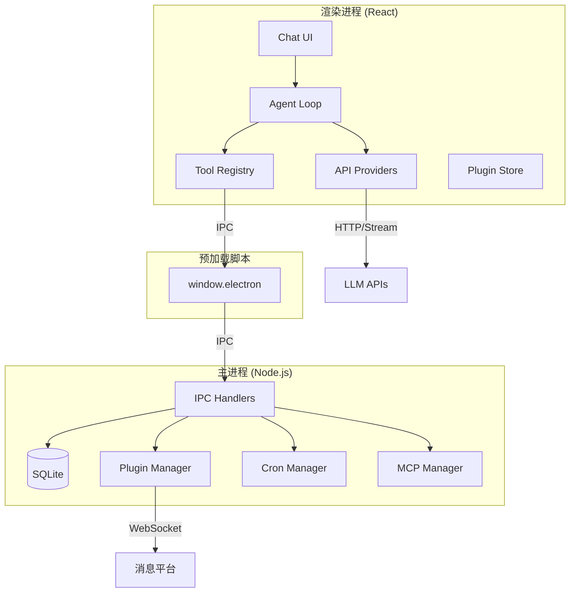

# 整体架构概述 / Architecture Overview

OpenCowork 基于 Electron 的双进程模型构建，主进程负责系统集成，渲染进程负责 UI 和 Agent 逻辑。

## 架构图 / Architecture Diagram

## 模块职责 / Module Responsibilities

### 主进程 (`src/main/`)

| 模块 | 职责 |
|------|------|
| `index.ts` | 创建窗口、系统托盘、注册 IPC 处理器 |
| `ipc/` | 各域 IPC 处理器（fs、db、plugins、mcp、cron） |
| `db/database.ts` | SQLite 数据库管理 |
| `plugins/` | 消息平台插件服务 |
| `cron/` | 定时任务调度 |
| `mcp/` | MCP 服务器管理 |

### 渲染进程 (`src/renderer/src/`)

| 模块 | 职责 |
|------|------|
| `lib/agent/` | Agent 循环、工具注册、系统提示 |
| `lib/api/` | AI 提供商适配层 |
| `lib/tools/` | 内置工具实现 |
| `lib/preview/` | 文件预览查看器 |
| `stores/` | Zustand 状态管理 |
| `hooks/` | React 自定义 Hooks |

## 数据流 / Data Flow

1. 用户在 UI 输入消息
2. `chat-store` 保存消息到 SQLite（via IPC）
3. `agent-store` 启动 Agent 循环
4. Agent 循环调用 LLM API（直接 HTTP，不经过主进程）
5. 工具调用通过 IPC 执行（文件系统、Shell 等）
6. 结果流式返回到 UI
