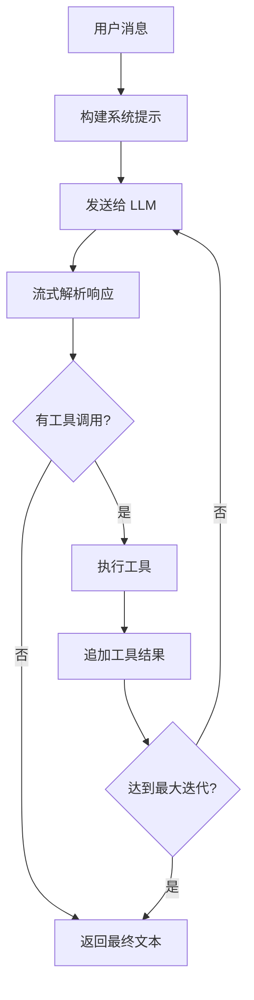

# Agent 循环 / Agent Loop

Agent 循环是 OpenCowork 的核心引擎，位于 `src/renderer/src/lib/agent/agent-loop.ts`。

## 工作原理 / How It Works

Agent 循环是一个 `AsyncGenerator<AgentEvent>`，每次迭代完成一轮 LLM 交互：



## 核心流程 / Core Flow

1. **构建消息**：将用户消息、历史记录、系统提示组合
2. **调用 LLM**：通过 `APIProvider.sendMessage()` 发起流式请求
3. **解析流**：处理 `text_delta`、`thinking_delta`、`tool_use` 等事件
4. **执行工具**：通过 `toolRegistry` 执行工具调用
5. **追加结果**：将工具结果追加到消息队列
6. **循环**：直到无工具调用或达到最大迭代次数（默认 10）

## AgentEvent 事件类型 / Event Types

```typescript
type AgentEvent =
  | { type: 'text_delta'; delta: string }
  | { type: 'thinking_delta'; delta: string }
  | { type: 'tool_call_start'; toolCall: ToolCallState }
  | { type: 'tool_call_result'; toolCallId: string; result: ToolResultContent }
  | { type: 'message_complete'; message: Message }
  | { type: 'error'; error: Error }
  | { type: 'aborted' }
```

## 重试机制 / Retry

当 LLM 调用失败时，Agent 循环会自动重试：

- 最多重试 **3 次**
- 指数退避：1s → 2s → 4s
- 网络错误和速率限制错误会触发重试
- 认证错误不重试

## 中止信号 / Abort Signal

每次 Agent 循环都接受一个 `AbortSignal`，用于取消正在进行的请求：

```typescript
const controller = new AbortController();
const loop = runAgentLoop(config, controller.signal);

// 取消
controller.abort();
```

## 上下文压缩 / Context Compression

当对话历史超过 token 阈值时，Agent 循环会自动触发压缩：

- **预压缩**（pre-compress）：清除过期工具结果
- **完整压缩**：调用 LLM 对历史进行摘要

详见 [上下文压缩](/docs/core-concepts/context-compression)。
