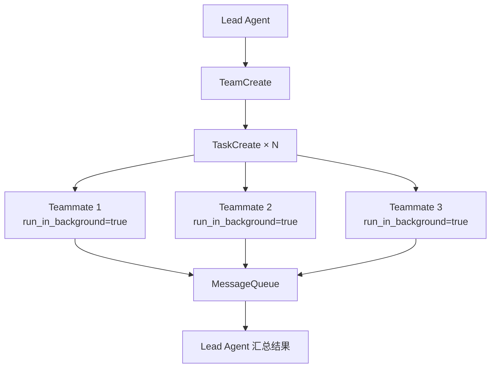

# Agent 团队 / Agent Teams

Agent 团队允许 Lead Agent 并行调度多个 Teammate Agent，协同完成复杂任务。

## 工作流程 / Workflow



## 创建团队 / Create Team

Lead Agent 使用 `TeamCreate` 工具创建团队：

```json
{
  "name": "代码重构团队",
  "description": "并行重构多个模块",
  "teammates": [
    { "name": "frontend-agent", "role": "重构前端组件" },
    { "name": "backend-agent", "role": "重构后端 API" }
  ]
}
```

## 并行执行 / Parallel Execution

每个 Teammate 通过 `Task(run_in_background=true)` 并行运行：

```json
{
  "subagent_type": "general-purpose",
  "prompt": "重构 src/components/Button.tsx",
  "run_in_background": true
}
```

## 通信机制 / Communication

Teammate 之间通过 `MessageQueue` 通信：

- **SendMessage**：向其他 Agent 发送消息
- **ReceiveMessage**：接收来自其他 Agent 的消息
- Lead Agent 可以广播消息给所有 Teammate

## 并发限制 / Concurrency

`ConcurrencyLimiter` 控制同时运行的 Teammate 数量，防止 API 速率限制：

```typescript
const limiter = new ConcurrencyLimiter(3); // 最多 3 个并发
```

## 生命周期 / Lifecycle

1. Lead Agent 创建团队并分配任务
2. Teammate 并行执行，通过 MessageQueue 汇报进度
3. Lead Agent 等待所有 Teammate 完成
4. Lead Agent 汇总结果并返回给用户
