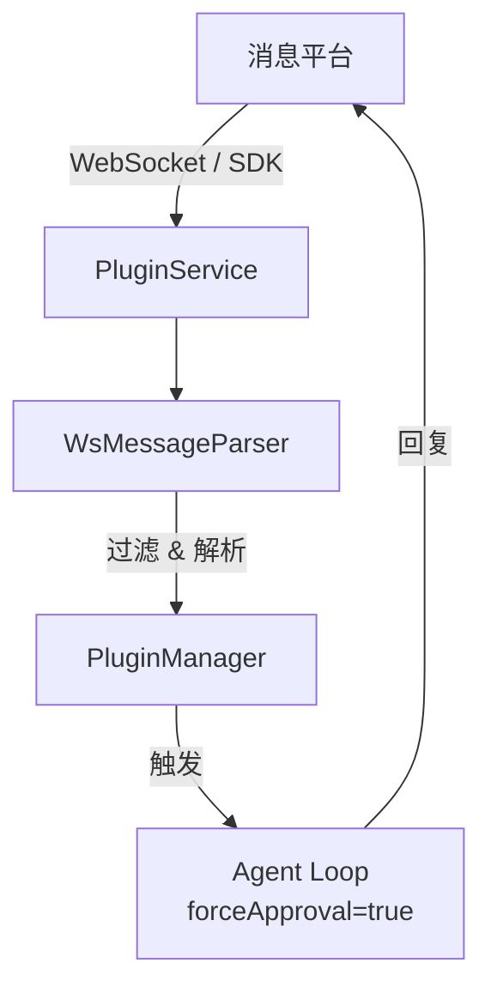

# 插件系统概述 / Plugin System Overview

插件系统让 OpenCowork 能够连接主流消息平台，实现 AI 自动回复。

## 架构 / Architecture



## 工厂注册模式 / Factory Registry

`PluginManager` 使用工厂模式管理插件：

```typescript
// 注册插件工厂
pluginManager.registerFactory('feishu', FeishuPluginFactory);
pluginManager.registerFactory('dingtalk', DingTalkPluginFactory);

// 创建插件实例
const plugin = pluginManager.create('feishu', config);
```

## WebSocket 传输层 / WebSocket Transport

大多数插件基于 `BasePluginService` 实现，使用 WebSocket 连接：

- 自动重连（指数退避）
- 心跳保活
- 消息队列（断线期间缓存消息）

飞书使用官方 Lark SDK，不使用原始 WebSocket。

## 自动回复机制 / Auto-Reply

收到消息后，插件触发 Agent 循环：

```typescript
// forceApproval=true 跳过所有工具审批
await runAgentLoop({
  messages: [userMessage],
  forceApproval: true,  // 自动批准所有工具调用
  sessionId: pluginSessionId,
});
```

<Callout type="warning">
  `forceApproval` 模式下，Agent 可以无需用户确认地执行所有工具操作。请确保插件配置安全可信。
</Callout>

## 插件工具 / Plugin Tools

插件启用时，会动态注册专属工具（如发送消息、获取群组信息）。插件禁用时自动注销这些工具。

## 支持的平台 / Supported Platforms

| 平台 | 文档 |
|------|------|
| 飞书 | [飞书集成](/docs/plugins/feishu) |
| 钉钉 | [钉钉集成](/docs/plugins/dingtalk) |
| Telegram | [Telegram 集成](/docs/plugins/telegram) |
| Discord | [Discord 集成](/docs/plugins/discord) |
| WhatsApp | [WhatsApp 集成](/docs/plugins/whatsapp) |
| 企业微信 | [企业微信集成](/docs/plugins/wecom) |
